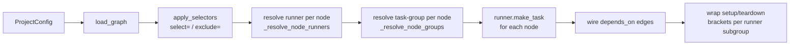

# Architecture

## The dispatch pipeline

Every `DbtDag(...)` or `DbtTaskGroup(...)` runs the same pipeline at parse time:



| Step | What it does |
|---|---|
| **load_graph** | Reads `target/manifest.json` (or runs `dbt parse`) and turns each `model`/`seed`/`snapshot`/`test` into a `DbtNode`. |
| **apply_selectors** | Filters via dbt-style selectors (`tag:foo`, `+x+`, `^upstream+`, …). UNION semantics across `select=`. |
| **_resolve_node_runners** | Maps every node to a runner name. Precedence: `overrides[uid].runner` > `meta.stratus.runner` > `tag_runners` > `default_runner`. |
| **_resolve_node_groups** | Maps every node to a `TaskGroup` name (or `None`). Strict: a node matching two groups raises. |
| **runner.make_task** | The runner builds one Airflow operator (or a 3-task setup/statement/teardown bracket) for the node. |
| **wire edges** | For every `(parent, child)` edge in the dbt graph, the corresponding tasks get `parent >> child`. |
| **setup/teardown** | Each runner subgroup that needs framing (e.g. shared Glue Session) gets a `setup` task at the head and `teardown` at the tail. |

The pipeline is shared by both `DbtDag` (returns a full DAG) and `DbtTaskGroup` (returns a
TaskGroup the caller embeds inside their own DAG).

## Modules

The lib is split into a small `common/` core plus per-backend runner packages, all under
the `dbt_aws.*` namespace package (no `__init__.py` at the root — PEP 420):

```
dbt_aws.common/
├── config.py            # ProjectConfig (manifest_path | manifest_dict | project_dir)
├── builder.py           # DbtDag, DbtTaskGroup, _attach_tasks, _resolve_node_runners
├── graph/               # manifest loading + DbtNode dataclass
│   ├── loader.py
│   ├── node.py
│   └── graph.py
├── select/              # dbt-style selectors (tag:, +x, x+, ^, @, exclude)
│   └── selector.py
├── runner/
│   ├── base.py          # Runner abstract base + dbt_command_for helper
│   ├── config.py        # load_runner_config, TaskGroupingConfig, LoadedRunnerConfig
│   ├── override.py      # resolve_override + RunnerOverride base
│   └── naming.py        # default per-model task-id sanitiser
├── airflow_extras/      # parse-time deployment helpers (S3 archive/wheel upload)
│   ├── auto_deploy.py
│   └── log_link.py
└── archive/             # tarball creation with stable sha256 fingerprint

dbt_aws.spark/runners/   # Spark-shape runners
├── glue_job.py          # GlueSparkRunner (Glue Spark Job)
└── glue_session.py      # GlueInteractiveSessionRunner (warm + per-node)

dbt_aws.nonspark/runners/
└── glue_python_shell.py # GluePythonShellRunner
```

## Runner interface

Every concrete runner subclasses `dbt_aws.common.runner.base.Runner`:

```python
class Runner(ABC):
    OVERRIDE_TYPE: ClassVar[type[RunnerOverride]]

    @abstractmethod
    def make_task(
        self,
        *,
        node: DbtNode,
        target: str,
        project_archive_s3: str,
        task_id: str,
        override: RunnerOverride,
        airflow_kwargs: dict[str, Any] | None = None,
    ) -> BaseOperator | tuple[BaseOperator, BaseOperator, BaseOperator]: ...

    # Optional: setup/teardown framing across all this runner's nodes
    def make_subgroup_setup_task(...) -> BaseOperator | None: ...
    def make_subgroup_teardown_task(...) -> BaseOperator | None: ...
```

`make_task` returns either:

- **A single operator** — `GlueJobOperator`, `PythonOperator`, etc.
- **A `(setup, statement, teardown)` triplet** — for runners that need per-node framing
  (Glue Session per-node).

The builder wires `parent >> child` between the *outermost* nodes of each side, so triplets
compose transparently.

## Two DAG-building entry points

```python
from dbt_aws.common.builder import DbtDag, DbtTaskGroup

# 1. Whole DAG -- subclass of airflow.sdk.DAG
dag = DbtDag(
    dag_id="my_dbt",
    project=ProjectConfig(...),
    runner=GlueSparkRunner(...),
    project_archive_s3="s3://...",
    start_date=datetime(2026, 1, 1),
)

# 2. TaskGroup embedded inside your own DAG
with DAG(dag_id="hybrid", ...) as dag:
    preflight = PythonOperator(...)
    dbt_tg = DbtTaskGroup(
        group_id="dbt_run",
        project=ProjectConfig(...),
        runner=GlueSparkRunner(...),
        project_archive_s3="s3://...",
    )
    notify = PythonOperator(...)
    preflight >> dbt_tg >> notify
```

For the third Cosmos-style variant (bare operators wired by hand), call `Runner.make_task`
directly with a `DbtNode` from `load_graph`.
